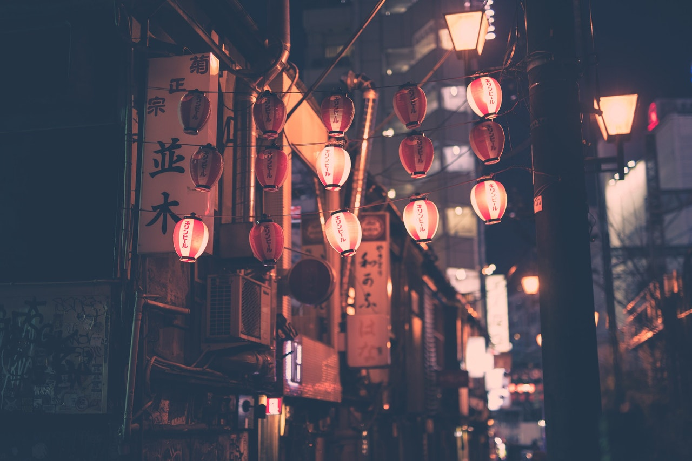
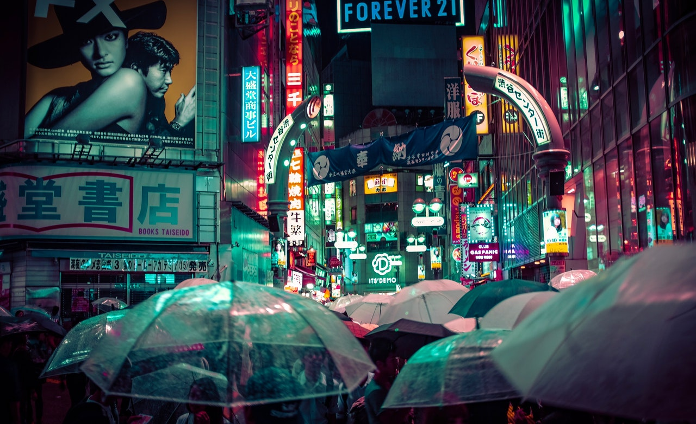
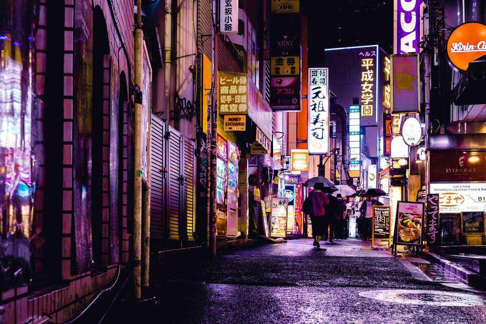

# Grid-Gallery
<!DOCTYPE html>
<html lang="en">
<head>
    <meta charset="UTF-8">
    <meta name="viewport" content="width=device-width, initial-scale=1.0">
    <link href="https://fonts.googleapis.com/css?family=Poppins:400,500&display=swap" rel="stylesheet"/>
    <link rel="stylesheet" href="./style.css">
    
</head>
<body>
    <header>
        <nav class="nav-bar">
            <ul>
                <li class="nav-lists"><a href="https://www.instagram.com/hamza_ejaz777/">Instagram</a></li>
                <li class="nav-lists"><a href="https://github.com/hamzaejaz787">Github</a></li>
                <li class="nav-lists"><a href="https://www.facebook.com/hamza.scout.07">Facebook</a></li>
            </ul>
        </nav>
    </header>
    <section class="img__wrapper">
        

            
        

        

            
        

        

            
        

        

            
        

        

            
        

        

            
        

    </section>
</body>
</html>
